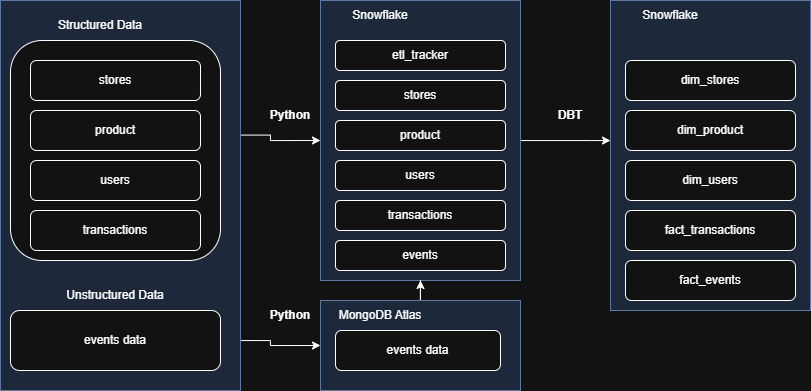

# catalys-de-assignment

## Project Overview
This repository contains the solution for the CATALYS Data Engineering Assignment. The project demonstrates hands-on experience with ETL pipelines, data modeling for both relational and NoSQL stores, and data transformation using SQL. It is designed to showcase practical decision-making, pipeline reliability, and data quality best practices.

### Key Features
- End-to-end ETL pipeline for ingesting, transforming, and loading data from multiple sources
- Incremental/delta load support
- Data quality checks and idempotent loads using file checksum tracking
- Data modeling for both Snowflake (relational) and NoSQL (design/justification)
- SQL-based business transformations
- Automated file load tracking to prevent duplicate loads

## Data Flow
The following diagram illustrates the high-level data flow of the ETL pipeline:



### Detailed ETL Steps
1. **Data Ingestion**:
   - Load structured CSV data (products, stores, transactions, users) from `data/` folder into Snowflake raw tables.
   - Load semi-structured JSON event data from `data/events/events.json` into MongoDB collection.
   - Use incremental loading with file checksums to avoid duplicates.

2. **Data Storage**:
   - Raw CSV data stored in Snowflake RAW schema tables.
   - Event data stored in MongoDB 'catalys.events' collection with indexes on key fields.

3. **Data Extraction and Loading to Relational DB**:
   - Extract event data from MongoDB and load into Snowflake RAW.EVENTS table as raw JSON strings.
   - Ensure no data transformation at this stage to maintain raw fidelity.

4. **Data Transformation**:
   - Use dbt to transform raw data into staging models.
   - Apply cleaning, standardization, and business logic.
   - Create mart models with dimensions and facts for analytics.

5. **Data Quality and Validation**:
   - Implement checks for nulls, duplicates, and schema consistency.
   - Log errors and handle failures gracefully.
   - Use file load tracking for idempotency.

## Setup Instructions

### Prerequisites
- Python 3.8+
- Snowflake account with appropriate permissions
- MongoDB Atlas or local MongoDB instance
- dbt-core installed (via dbt/requirements.txt)

### 1. Clone the Repository
```bash
git clone <repo-url>
cd catalys-de-assignment
```

### 2. Install Python Dependencies
For the main ETL pipeline, use a virtual environment in the root:
```bash
python -m venv venv
source venv/bin/activate  # On Windows: venv\Scripts\activate
pip install -r requirements.txt
```

For dbt transformations, use the isolated venv in the `dbt/` folder:
```bash
cd dbt
python -m venv venv
venv\Scripts\activate  # On Windows
pip install -r requirements.txt
```

### 3. Configure Environment Variables
Create a `.env` file in the root directory with the following variables:
```
MONGODB_URI=<your_mongodb_connection_string>
SNOWFLAKE_USER=<your_user>
SNOWFLAKE_PASSWORD=<your_password>
SNOWFLAKE_ACCOUNT=<your_account>
SNOWFLAKE_WAREHOUSE=<your_warehouse>
SNOWFLAKE_DATABASE=CATALYS
SNOWFLAKE_SCHEMA=RAW
SNOWFLAKE_TRACKING_TABLE=etl.file_load_tracking
```

### 4. Configure Ingestion
Edit `config/ingestion_config.yml` to specify the tables, file paths, and patterns for your data sources. The config includes:
- Table names
- File paths
- Column mappings
- Load options

### 5. Prepare Databases
- **Snowflake**:
  - Create the required raw tables and the file load tracking table using the provided DDLs in the `ddl/` folder.
  - Example for file tracking table:
  ```sql
  CREATE OR REPLACE TABLE etl.file_load_tracking (
      file_name VARCHAR,
      file_checksum VARCHAR,
      table_name VARCHAR,
      load_timestamp TIMESTAMP DEFAULT CURRENT_TIMESTAMP,
      status VARCHAR
  );
  ```
  - Ensure the warehouse, database, and schema exist.

- **MongoDB**:
  - Set up a MongoDB database named 'catalys'.
  - The collection 'events' will be created automatically with indexes.

### 6. Run the ETL Pipeline
#### Load CSV Data to Snowflake:
To load all tables:
```bash
python etl/load_to_snowflake.py --all
```
To load a specific table:
```bash
python etl/load_to_snowflake.py --table transactions
```

#### Load Events to MongoDB:
```bash
python etl/load_events_to_mongo.py
```

#### Load Events from MongoDB to Snowflake:
```bash
python etl/load_mongodb_to_snowflake.py
```

#### Run dbt Transformations:
```bash
cd dbt/catalys_dbt_project
dbt run
```

## Project Structure
```
catalys-de-assignment/
├── README.md                          # Project documentation
├── requirements.txt                   # Python dependencies for ETL
├── assignment/
│   └── assignment.md                  # Assignment requirements
├── config/
│   └── ingestion_config.yml           # ETL configuration
├── data/
│   ├── events/
│   │   └── events.json                # Event data (JSON)
│   ├── products/
│   │   └── products.csv               # Product data
│   ├── stores/
│   │   └── stores.csv                 # Store data
│   ├── transactions/
│   │   └── transactions.csv           # Transaction data
│   └── users/
│       └── users.csv                  # User data
├── dbt/
│   ├── requirements.txt               # dbt dependencies
│   └── catalys_dbt_project/
│       ├── dbt_project.yml            # dbt project config
│       ├── models/
│       │   ├── staging/               # Raw data staging models
│       │   │   ├── sources.yml        # Source definitions
│       │   │   ├── stg_products.sql   # Product staging
│       │   │   ├── stg_stores.sql     # Store staging
│       │   │   ├── stg_transactions.sql # Transaction staging
│       │   │   ├── stg_users.sql      # User staging
│       │   │   └── stg_events.sql     # Event staging (if needed)
│       │   └── mart/                  # Business logic models
│       │       ├── dim_products.sql   # Product dimension
│       │       ├── dim_stores.sql     # Store dimension
│       │       ├── dim_users.sql      # User dimension
│       │       ├── fact_sales.sql     # Sales fact table
│       │       └── schema.yml         # Model tests and docs
│       ├── macros/
│       │   └── generate_hash.sql      # Custom macros
│       └── target/                    # dbt artifacts
├── ddl/
│   ├── file_load_tracking.sql         # Tracking table DDL
│   ├── raw_events.sql                 # Events table DDL
│   ├── raw_product.sql                # Products table DDL
│   ├── raw_store.sql                  # Stores table DDL
│   ├── raw_transactions.sql           # Transactions table DDL
│   └── raw_users.sql                  # Users table DDL
├── design/
│   └── Catalys_Assignment.drawio.png # Data flow diagram
├── etl/
│   ├── load_events_to_mongo.py        # Load events to MongoDB
│   ├── load_mongodb_to_snowflake.py   # Load MongoDB to Snowflake
│   └── load_to_snowflake.py           # Load CSVs to Snowflake
├── mongodb/
│   ├── connect_mongo.py               # MongoDB connection utility
│   └── setup.txt                      # MongoDB setup notes
└── logs/                              # ETL logs
```

## Data Quality & Reliability
- **File Checksum Tracking**: Uses MD5 hashes to track loaded files, ensuring idempotent loads and preventing duplicates.
- **Validation Checks**: 
  - Null value checks for critical columns
  - Duplicate detection based on primary keys
  - Schema validation against expected data types
  - Data range and format validations
- **Error Handling**: 
  - Comprehensive logging with timestamps and error levels
  - Graceful failure handling with rollback capabilities
  - Alert mechanisms for critical failures
- **Idempotency**: Pipelines can be rerun safely without data corruption
- **Monitoring**: Logs stored in `logs/` directory for audit and debugging

## Data Modeling Decisions
### Relational (Snowflake)
- **Normalization**: Raw tables in RAW schema store data in normalized form
- **Analytics-Friendly**: Mart models denormalize for query performance
- **Keys**: Primary keys on IDs, foreign keys for relationships

### NoSQL (MongoDB)
- **Document Model**: Events stored as flexible JSON documents
- **Indexing**: Indexes on event_id (unique), user_id, event_type, timestamp
- **Justification**: Events have variable schemas, require fast ingestion, and are queried by user/time patterns

## Notes
- The ETL pipeline is designed for extensibility and can be adapted for additional sources or targets.
- NoSQL modeling and justification are documented above and in the design folder.
- Assumptions: Data volumes are manageable for batch processing; network connectivity is stable.

For any questions, please refer to the assignment requirements or contact the repository maintainer.
